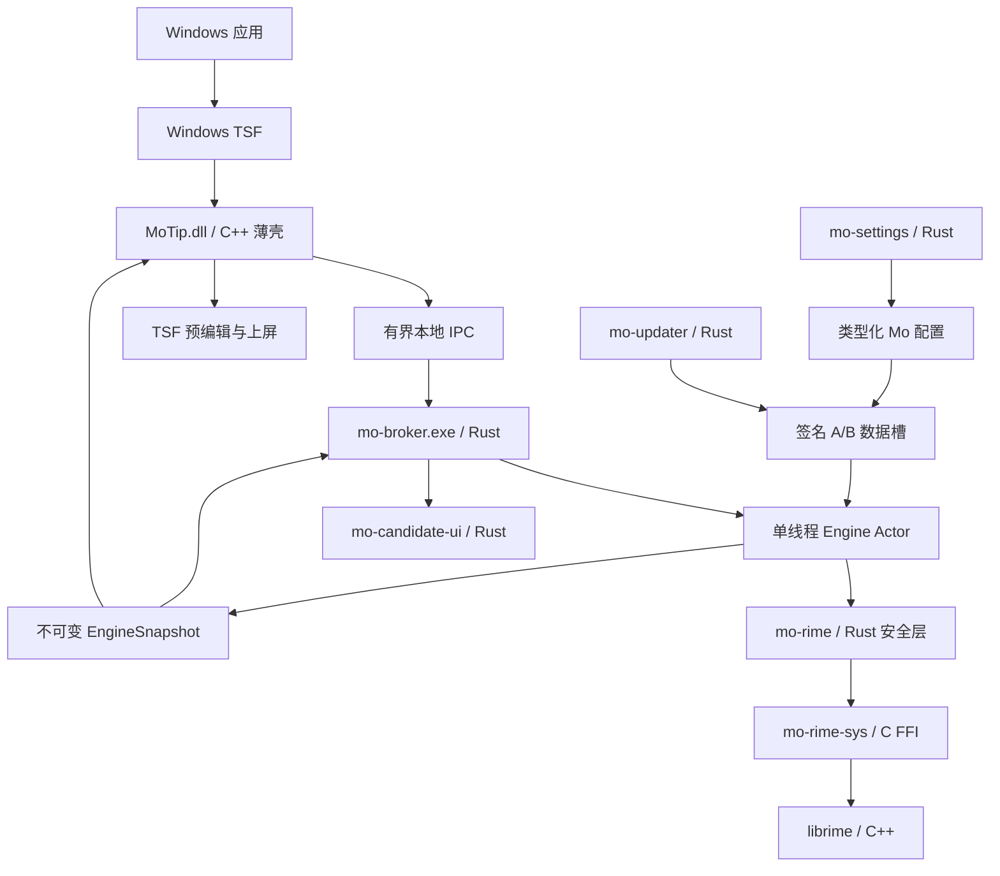

# Mo（墨）输入法：产品与软件架构设计 v0.2

> 状态：设计基线已确认，Phase 0 已启动  
> 核验日期：2026-09-11  
> 当前范围：只设计并开发 Windows；其他平台只保留稳定边界，不排期、不建空壳工程。

## 0. 本轮结论

Mo 的方向由“Rime 兼容输入法”进一步收敛为：

> **一款面向普通 Windows 用户、安装即用、本地优先的开源中文输入法。**

已经确认的产品与技术基线：

1. Mo 先以开源项目发展。
2. Windows 平台前端由 Mo 自主实现，不复制 Weasel 等 GPL 前端源码。
3. Rust 是 Mo 的主要开发语言；采用 Rust-first 混合架构，不以“纯 Rust”作为产品目标。
4. 第一阶段只支持 Windows，其他平台必须等阶段评审后再启动。
5. 普通用户不接触 YAML、部署、用户目录或手工词库替换。
6. 下载一个安装包，完成一次正常的 Windows 授权后即可通过 `Win + Space` 使用。
7. 默认方案、词库、编译产物和更新全部由 Mo 托管；用户只看到“墨·拼音”。
8. 输入、学习与候选热路径默认离线；账号、云同步和云候选不进入 v1。

核心技术组合：

```text
Mo 自主 C++ TSF 薄壳
  -> 有界、版本化本地 IPC
  -> Rust Broker / Engine Actor / Candidate UI
  -> Rust 安全封装
  -> librime 官方 C API
  -> 上游 C++ librime
```

这不是对 Rust 的妥协，而是明确风险边界：Rust 承担长期产品逻辑；进入任意第三方应用进程的 TSF DLL 保持极薄、可审计、无词库、无网络。

## 1. 产品定位

### 1.1 第一用户

v1 只把普通中文用户视为第一用户：

- 用户知道如何安装软件，但不知道 Rime、schema、部署或用户目录。
- 用户希望安装后直接输入，不愿先选择词库、复制文件或阅读教程。
- 用户需要稳定的全拼、中英混输、本地学习、简繁切换和好看的候选窗。
- 用户可以接受 Windows 的 UAC、SmartScreen 或输入法授权步骤，但产品必须解释清楚并提供一键修复。

效率用户是第二用户：可切换双拼、模糊音、快捷键、自定义短语和应用级学习策略。

Rime 高级用户不是默认界面的目标人群。Mo 可以提供显式导入和开发者诊断能力，但不得把 Rime 的内部概念暴露成普通用户的必修课。

### 1.2 一句话承诺

> **墨输入法：装完就能打，字在本地，习惯归你。**

### 1.3 v1 不做什么

- 不做账号、云同步、云联想和广告。
- 不做语音、手写、OCR 或 LLM 续写。
- 不做插件市场。
- 不要求用户自行下载或更新 rime-ice。
- 不同时开发 macOS、Linux、Android 或 iOS。
- 不把“高度可配置”放在“默认好用”之前。

## 2. 普通用户体验

### 2.1 默认输入体验

安装后只出现一个对用户可见的方案：**墨·拼音**。

默认值：

- 简体全拼、中文优先、半角标点。
- 中英混输开启。
- 本地动态学习开启。
- 保守的错键纠正开启，激进模糊音关闭。
- Emoji 低权重可用，不抢常用词。
- 数字键选词，`Shift` 切换中英文，`-` / `=` 翻页。
- 繁体和拆字可用，但不占据首屏。
- 网络候选、诊断上传和同步全部关闭。

双拼不是多个平级输入法。用户在设置里的“输入方式”选择全拼、自然码、小鹤、微软或搜狗双拼；内部由声明式键位 profile 生成 `mo_*` schema。切换前提供实时测试框，避免选错后无法输入。

### 2.2 一键安装

对外承诺应写成：

> 下载已签名的 `MoSetup.exe`，双击并同意一次 UAC；安装完成后按 `Win + Space` 即可使用。

不能承诺无 UAC、永不出现 SmartScreen，也不能静默抢占系统默认输入法。这些属于 Windows 安全边界。

安装器只有三个页面：

1. **安装墨输入法**：一个主按钮；说明“离线即可输入，默认不上传输入内容”。
2. **正在安装**：只显示安装组件、注册输入法、正在启用，不暴露 CLSID、COM、TSF 和词库编译。
3. **安装完成**：提供可直接打字的测试框、“现在切换到墨”、“打开设置”和 `Win + Space` 提示。

安装完成时已经具备预编译词典。用户首次切换和首次按键时不得出现“正在部署”或初始化进度条。

安装器通过 Windows 官方 API 注册并启用 profile：

- 用 `ITfInputProcessorProfileMgr::RegisterProfile` 注册。
- 用 `InstallLayoutOrTip` 加入当前用户的输入法列表。
- 只有用户点击“现在切换到墨”后才调用 `ActivateProfile`。
- 不直接修改私有注册表，不使用 `ILOT_CLEANINSTALL`，不删除其他输入法，不强制成为默认项。

### 2.3 日常界面

候选窗只承担输入，不承担运营：

- 候选、序号、注音或简短提示。
- 当前中英文、简繁状态的轻量反馈。
- 首次使用只出现一次“Shift 切换中英文”提示。
- 不展示新闻、广告、活动、签到或账号入口。

快捷面板只保留：

- 中 / 英；
- 简 / 繁；
- 全角 / 半角；
- 隐私模式。

常规设置只保留：

- 输入方式；
- 候选与外观；
- 快捷键；
- 词库与更新；
- 隐私、本地学习和数据导入导出。

模糊音细项、最终 schema、Lua、部署日志和数据 generation 放入二次开启的开发者模式。普通设置写入强类型 Mo 配置，再由生成器产生 patch；界面不直接编辑 YAML。

### 2.4 失败体验

设置中心提供“一键修复”，检查签名、x86/x64 注册、TSF profile、当前用户启用状态、Broker、IPC 和词典 generation。

三个删除动作必须分开：

- 恢复默认设置；
- 清空本地学习；
- 彻底重置全部用户数据。

卸载默认保留用户词和设置；只有用户明确勾选“同时删除我的数据”才删除，并说明不可恢复。

## 3. 开发语言与边界

### 3.1 最终建议：Rust-first 混合架构

Rust 覆盖：

- `mo-domain`：按键、候选、预编辑、状态、错误和配置模型。
- `mo-engine`：Engine Actor、会话注册、命令与快照。
- `mo-rime-sys`：librime 原始 C FFI。
- `mo-rime`：librime 的安全 RAII 封装。
- `mo-ipc`：版本化 IPC 协议和校验。
- `mo-broker`：当前用户引擎进程。
- `mo-candidate-ui`：候选窗状态和 Rust/Win32 渲染。
- `mo-pack`、`mo-updater`、`mo-doctor` 与测试工具。
- 设置应用的业务逻辑。

C++17 只覆盖：

- 上游 librime 及其依赖。
- Mo 自主实现的 `MoTip.dll` 极薄 TSF/COM 壳。
- 若 Rust/Win32 候选窗的 UI Automation 接口在验证中不稳定，可保留极小的 Windows UI ABI 辅助层。

非业务语言与工具：

- MSI/Burn 或同等级安装工具的声明文件。
- CMake 只构建固定版本的 librime。
- PowerShell 仅用于 CI 和签名编排，不进入输入热路径。

### 3.2 为什么 v1 不强求纯 Rust TSF

微软维护的 `windows-rs` 已能声明和实现 COM 接口，纯 Rust TSF 在技术上可行。但 TSF DLL 会被加载到 Explorer、Office、浏览器、Electron 等宿主进程；panic、引用计数错误、loader lock、死锁或 ABI 问题都会直接影响宿主。

因此 v1 默认使用 Mo 自主编写的 C++/WRL 薄壳：

- 只实现 COM class factory、TSF sinks、edit session、composition、UIElement 与 IPC。
- 不加载 librime，不解析 YAML，不访问用户词库，不更新，不联网。
- 不包含候选排序、用户学习或产品配置逻辑。
- 所有同步等待都有硬截止时间；Broker 不可达时立即安全降级。

同时保留一个独立的纯 Rust TSF spike。只有它通过与 C++ 壳完全相同的 x86/x64、COM 合约、宿主兼容、故障注入和长时间稳定性测试，才允许替换，不让语言纯度阻塞 MVP。

### 3.3 Rust 与 librime 的 FFI 规则

Mo 只通过官方 `rime_api.h` 访问 librime，不进入 C++ 对象模型，也不需要额外 `cxx` bridge。

约束：

- `mo-rime-sys` 是唯一集中保存 librime `unsafe` 的 crate。
- 对固定 commit 的头文件生成 allowlist bindings，并把生成结果提交到仓库。
- CI 用 C probe 验证 `sizeof`、`alignof`、关键 `offsetof` 和结构初始化。
- C 的 `Bool` 绑定为整数，不误绑成 Rust `bool`。
- `get_commit`、`get_context`、`get_status` 与 `free_*` 严格配对。
- librime 返回的临时指针立即复制为 Rust owned value。
- notification callback 不阻塞、不 panic、不重入 librime。
- C++ 异常和 Rust unwind 都不得越过 FFI/COM 边界。
- 原始 session 和指针天然 `!Send + !Sync`，只允许 Engine Actor 拥有。

Rust 工具链使用稳定通道、2024 edition 和 MSVC target；版本写入 `rust-toolchain.toml` 并由 CI 固定，不跟随开发机浮动升级。

## 4. Windows 运行架构



### 4.1 进程模型

- 每个宿主进程加载对应位数的 `MoTip.dll`。
- 同一个 Windows 登录会话只有一个普通用户权限的 `mo-broker.exe`。
- x86 与 x64 TIP 连接同一个 x64 Broker；不为 32 位应用复制一套用户词库。
- Broker 可以并发接入客户端，但所有 librime 调用进入唯一 Engine Actor。
- 候选窗使用独立 UI/message-loop，只消费 owned snapshot。
- 下载、词典编译、部署和诊断不得占用 Engine Actor。

`process_key + get_commit + get_context + get_status` 是一个不可交错事务，返回一份带递增 `revision` 的不可变快照。

### 4.2 核心命令契约

Windows 内部直接使用 Rust domain API；未来平台通过 `mo-core-ffi` 的稳定 C ABI 接入。Windows v1 不为了“抽象”而在 Rust crate 之间重复经过 C ABI。

```rust
enum EngineCommand {
    Key(KeyEvent),
    SelectCandidate { index: u32 },
    ChangePage { backward: bool },
    SetOption { name: String, value: bool },
    Commit,
    Clear,
}

struct EngineSnapshot {
    revision: u64,
    handled: bool,
    commit: Option<String>,
    composition: Option<Composition>,
    candidates: Vec<Candidate>,
    status: EngineStatus,
}

trait EngineBackend {
    fn create_session(&mut self, options: SessionOptions)
        -> Result<BackendSession>;
    fn apply(
        &mut self,
        session: BackendSession,
        command: EngineCommand,
    ) -> Result<EngineSnapshot>;
    fn destroy_session(&mut self, session: BackendSession);
}
```

生产链路：

```text
EngineClient
  -> channel
  -> EngineActor
  -> LibrimeBackend (!Send + !Sync)
```

测试可替换为 `FakeBackend`、`ReplayBackend` 或跨 IPC 的 `BrokerBackend`。

### 4.3 IPC 契约

本地 named pipe 使用当前登录 session 命名和精确 ACL。协议至少包含：

- magic、major/minor 版本和 feature bits；
- connection generation、session token、request ID；
- 消息长度硬上限、deadline 和 UTF-8 校验；
- snapshot revision；
- 当前版本与前一版本的兼容协商。

Broker 把所有客户端当作不可信输入：不接受任意路径、URL、命令或插件加载请求，也不允许一个宿主读取另一个宿主的 session。

按键 IPC 有严格超时：

- 未组合时 fail-open，让原按键回到应用。
- 组合中不盲目透传，先清理可证明安全的 composition 并重建连接。
- 不确定某次 commit 是否已经上屏时，永不重放。
- 调用 TSF edit session 时不得持有 pipe、Engine reply 或候选窗锁。

### 4.4 文本索引

Core 不传递无单位的 `int offset`。领域类型至少包括：

- `Utf8ByteOffset`；
- `Utf16CodeUnitOffset`；
- `UnicodeScalarIndex`；
- `GraphemeClusterIndex`。

删除和光标移动按用户可见字素簇处理；平台边界进行受检转换。

## 5. 自主 Windows 前端

### 5.1 MoTip.dll

由 Mo 从微软 TSF 文档出发自主实现，不复制 Weasel 源码。主要职责：

- `DllGetClassObject`、`DllCanUnloadNow` 和 COM 引用计数；
- `ITfTextInputProcessorEx` 激活与停用；
- focus、thread、key、composition 与 UIElement sinks；
- `OnTestKey*`、`OnKey*` 与 `RequestEditSession`；
- composition range、display attribute、language bar 和 UIless candidate；
- IPC 连接、超时、Broker 重连与少量同步状态缓存。

`DllMain` 只做最小静态初始化：不启动线程、不初始化 COM、不访问网络、不等待 Broker。

### 5.2 候选窗

候选窗由 Mo 自主设计，Rust 使用 Windows API、Direct2D 和 DirectWrite 渲染：

- no-activate，不抢应用焦点；
- Per-Monitor DPI；
- 横排、竖排与候选翻页；
- 深浅模式与高对比度；
- 多显示器、RDP 和缩放；
- TSF UIless/search 场景交给系统候选接口；
- 通过 UI Automation / TSF UIElement 提供可访问候选信息。

输入进程和候选窗不嵌入 WebView。

### 5.3 当前 Windows 支持口径

GA 主支持当前仍在微软生命周期内的 Windows 11 x64 版本。Windows 10 22H2 已于 2025-10-14 结束常规支持，因此只作为尽力兼容目标，不作为安全支持承诺。

安装包提供：

- x64 Broker、设置与候选 UI；
- x64 TIP；
- x86 TIP，用于 64 位 Windows 上的 32 位 Office 和其他宿主。

ARM64 / ARM64X 在 x64 Beta 稳定后单独立项，不进入第一阶段。

## 6. 安装、更新与回滚

### 6.1 安装形态

推荐签名的 Burn/同类 bootstrapper 包含 MSI：

- 一次 UAC，默认安装到 `Program Files\Mo`。
- MSI 显式声明 x86/x64 COM 注册，避免 `regsvr32` / SelfReg。
- 机器级文件安装和当前用户启用分开执行，避免提权 token 写错用户的 `HKCU`。
- 安装事务支持 rollback、repair、major upgrade、企业静默部署和“应用和功能”卸载。

首发不安装 LocalSystem 常驻更新服务。

### 6.2 二进制更新

TSF DLL 可能长期驻留在多个应用，不能原地覆盖：

1. 新版本写入版本化目录。
2. 验证 Authenticode、产品、架构、版本、清单签名和文件哈希。
3. 通过 MSI 事务切换 COM 路径。
4. 已打开应用继续使用旧 DLL，新应用加载新 DLL。
5. 保留 N-1，健康确认后再清理。

普通用户 updater 以普通权限检查；需要安装核心更新时由用户点击并出现一次 UAC。v1 不以高权限服务换取完全静默更新。

### 6.3 数据包更新

```text
下载 inactive slot
  -> 签名 / 哈希 / 许可证 / ABI 校验
  -> 独立 helper 编译
  -> headless smoke cases
  -> 等待无 composition
  -> 切换 current.json
  -> 重建 session
  -> 异常自动回滚
```

内置只读兜底包永远保留。任何更新失败只能延后新数据生效，不能让输入不可用。

所有可执行产物、MSI 和外层 Setup 都使用同一发布者的 SHA-256 Authenticode 与 RFC 3161 时间戳。安装器完成页提供签名状态和一键修复，但普通界面不展示证书术语。

## 7. 词库、rime-ice 与用户数据

### 7.1 用户看不到部署

rime-ice 是构建输入，不是用户操作步骤：

- CI 锁定上游 commit 和内容哈希。
- 上游文件只读，Mo 修正在规范层和 patch 层完成。
- 生成 `mo_*` schema、dictionary 和 user_dict 名称。
- 与指定 librime 版本一起预编译并跑 golden tests。
- 安装器只交付已验证产物与对应源码/构建信息。
- 用户不复制文件、不选择 Rime 目录、不点击“重新部署”。

初始可复现基线继续锁定 rime-ice 稳定标签 `2026.06.30`，提交 `6810e8916d160498620a16fef2135956fecbd485`；升级必须通过候选回归与许可证检查。

### 7.2 默认包

v1 内置可离线使用的“墨标准词库”：

- 8105 常用字；
- 基础与精选扩展中文词库；
- 基础英文和中英混输；
- OpenCC 简繁；
- Emoji 与拆字数据；
- 经过审核的纠错规则。

腾讯大词库、41448 大字表、语法模型和专业领域词库不进入最小安装包。后续可提供“扩展词库”一键开关，但仍由 Mo 下载、测试、激活和回滚。

不要把 rime-ice 的 `others.dict` 直接并入普通词库；其中的故意错音与纠错知识进入独立 `correction` 层。上游作者个人 `custom_phrase.txt` 不作为 Mo 用户默认。

### 7.3 数据目录

```text
Program Files/Mo/.../builtin/      安装包内只读兜底
LocalAppData/Mo/managed/slots/A/   官方数据槽 A
LocalAppData/Mo/managed/slots/B/   官方数据槽 B
LocalAppData/Mo/managed/current.json
LocalAppData/Mo/profile/settings/
LocalAppData/Mo/profile/userdb/
LocalAppData/Mo/profile/phrases/
LocalAppData/Mo/profile/blacklist/
LocalAppData/Mo/profile/build/
```

`builtin` 与 `managed` 可替换；`profile` 归用户所有，更新器永不覆盖。

### 7.4 本地学习

- 中文 user dictionary 固定命名 `mo_zh`，英文固定为 `mo_en`。
- 动态学习、固定短语、隐藏/降权词和导入词条分开保存。
- 删除单词、暂停学习、隐私模式和按应用禁用学习属于 v1。
- 词库升级使用 copy-on-write 和用户数据快照。
- 跨版本、跨输入方案迁移使用规范化文本记录，不直接复制二进制 LevelDB。
- 全拼与双拼共享 userdb 之前必须通过真实回归，不能只凭名称相同假设兼容。

## 8. 开源与许可证

### 8.1 已确认基线

Mo 先开源且前端自主实现。已确认：

- Mo 自有 Rust/C++ 源码采用 `Apache-2.0`，保留专利授权和未来产品灵活性。
- librime 作为 BSD-3-Clause 外部依赖。
- 不复制 Weasel、Squirrel、Trime 等 GPL 前端源码。
- rime-ice 衍生资源作为边界明确的 `GPL-3.0-only` 包，公开精确对应源码、构建脚本、修改记录、GPL 文本和第三方通知。
- 每个发布产物生成 SPDX/SBOM 与 `THIRD_PARTY_NOTICES`。

Mo 自有代码已确定采用 Apache-2.0。rime-ice 包及其各上游来源义务不能被覆盖或改名消除。

Phase 0 验证还确认：librime 1.17.0 官方 Windows 预构建 DLL 静态包含 GPL-3.0-only 的 librime-octagram，因此该 DLL 只用于开发验证，不进入 Mo 发行物。正式发行从锁定源码构建允许列表版本，当前只包含 BSD-3-Clause core 与 rime-ice 必需的 BSD-3-Clause librime-lua。

### 8.2 分发门

rime-ice 的根许可证为 GPL-3.0-only，其 Credits 还包含 Unicode License、LGPL、MIT、Apache-2.0、CC BY、Public Domain 等来源。

因此默认安装包发布前必须完成：

- 每个文件的来源、commit、许可证和 transform hash 可追溯；
- 预编译数据有可复现的对应源；
- 归属、修改声明和许可证文本完整；
- 对“安装器内默认捆绑”的实际组合做正式法律审查。

这部分是工程风险控制，不构成法律意见。

## 9. 安全与隐私

- 输入 DLL、Broker 和候选窗均无网络客户端。
- 原始按键、未提交拼音、候选、上屏文本、surrounding text、剪贴板和密码字段不进入普通日志。
- 密码/PIN 字段禁用学习、上下文读取和诊断。
- 更新请求只包含产品版本、架构、通道和随机 rollout bucket。
- 崩溃 dump 可能带宿主内容，不自动上传 full-memory dump。
- 数据包带签名、哈希、兼容范围和防降级元数据。
- Lua 与原生插件视为代码，不作为普通词库静默加载。

数据等级：

- D0：公共词库、方案与模型，可签名更新。
- D1：用户明确创建的设置和短语，只做本地导入导出。
- D2：本地推断的学习权重，默认不上传。
- D3：原始按键、preedit、上下文、剪贴板、密码和目标应用内容，禁止上传。

## 10. 性能与可靠性预算

这些是验收门，不是当前实测值：

- 按键到 EngineSnapshot：p95 小于 8 ms，p99 小于 16 ms。
- 按键到候选首次绘制：p95 小于 25 ms。
- 本地 IPC：p95 小于 3 ms。
- 已安装首次切换可输入：小于 500 ms，不做词典编译。
- 空闲 CPU 接近 0。
- Broker 崩溃恢复小于 2 秒，不重复上屏。
- 数据更新失败后上一版本 100% 可用。
- 升级、回滚和卸载默认 100% 保留用户词频与短语。
- 公开 Beta 无崩溃会话率至少 99.95%。

## 11. 测试战略

优先级从底到顶：

1. **FFI 合约**：C/Rust 大小、对齐、offset、函数表版本、NULL、无效 UTF-8 与生命周期。
2. **Engine golden**：固定引擎、schema、词库与按键流，比较完整 snapshot。
3. **Direct-vs-IPC 差分**：相同命令流直接 FFI 与 Broker 输出一致。
4. **多 session**：交错输入不串 composition、option、candidate 或 commit。
5. **IPC fuzz**：畸形长度、截断、重复、乱序、过时 generation、慢客户端。
6. **TSF 故障注入**：Broker 卡死/退出、edit lock 拒绝、焦点快速切换、宿主退出。
7. **Windows 应用矩阵**：Notepad、Office、Chromium、Electron、WinUI/UWP、终端、系统搜索、RDP。
8. **显示矩阵**：x86/x64、DPI、多显示器、高对比度、UIless 和辅助功能。
9. **安装矩阵**：全新安装、覆盖升级、回滚、修复、卸载、占用旧 DLL、非管理员用户。
10. **供应链**：签名、SBOM、许可证、损坏包、降级攻击和断电恢复。

发布前必须在真实 Windows 应用中做 soak test；模拟按键测试不能替代 TSF 生命周期测试。

## 12. Rust Workspace 建议

```text
Mo/
  Cargo.toml
  rust-toolchain.toml
  crates/
    mo-domain/
    mo-engine/
    mo-rime-sys/
    mo-rime/
    mo-ipc/
    mo-broker/
    mo-candidate-ui/
    mo-settings/
    mo-updater/
    mo-pack/
    mo-doctor/
    mo-core-ffi/
  native/
    windows-tip/
    librime/
  installer/
    windows/
  packs/
    mo-default/
    patches/rime-ice/
    vendor.lock.yaml
  tests/
    golden/
    ffi-contract/
    ipc-fuzz/
    windows-compat/
    installer/
  third_party/
    manifest.lock
    NOTICE/
  docs/
    adr/
    threat-model/
```

依赖规则：

- 只有 `mo-rime-sys` 依赖 librime raw API。
- 只有 `mo-broker` 组合真实 engine、IPC 和平台服务。
- `mo-domain` 与 `mo-engine` 不允许依赖 Windows 类型。
- `windows-tip` 不依赖 librime、词库或设置实现。
- `mo-core-ffi` 只导出平台无关 owned 数据，为未来端口保留 ABI。
- 其他平台不建立空目录；通过依赖规则、C ABI 合约和平台无关 golden corpus 保留口子。

## 13. 阶段路线与确认门

后续每个阶段都需要用户确认后再进入；其他平台不属于这些阶段。

### Phase 0：风险验证，约 2 周

- 建立 Rust workspace、固定 toolchain 和依赖锁。
- 完成 `mo-rime-sys` ABI probe 和 headless `nihao -> 你好`。
- 完成 Mo 自主 C++ TSF 壳到 Rust Broker 的最小 IPC。
- 做纯 Rust TSF spike，只评估，不阻塞主路线。
- 验证 x86/x64 TIP、AppContainer pipe ACL 和同步超时。
- 验证单个签名测试安装包、注册、启用、修复和卸载。
- 完成 rime-ice 实际打包的 SPDX/SBOM 草案。

退出门：FFI、TSF、IPC、安装和许可证五类最高风险都有真实证据。

### Phase 1：可输入内核，约 3–4 周

- Engine Actor、session、snapshot、错误和恢复。
- 默认预编译词库、用户学习与 typed config。
- golden runner、差分测试、包 A/B 激活与回滚。
- 初版候选窗。

退出门：开发机上安装后直接完成日常中文输入，更新失败不影响输入。

### Phase 2：Windows Alpha，约 5–7 周

- 完整 TSF composition、候选、UIless、应用级状态。
- 普通设置、双拼切换、数据导入导出。
- 三页安装器、更新器、一键修复和诊断。
- x86/x64、Office、浏览器、Electron、DPI、多屏和 RDP。

退出门：无需 YAML 或手工词库操作，可以作为开发者日常主输入法。

### Phase 3：公开 Beta，约 4–6 周

- Authenticode、签名更新、灰度与回滚。
- 性能、隐私、无障碍、崩溃恢复和长时间 soak。
- 官网下载、校验值、发行说明和开源合规材料。

退出门：达到性能预算、99.95% 无崩溃会话目标和安装成功率门槛。

### Future Gate：其他平台

只有在 Windows Beta 结论评审并由项目所有者明确确认后，才选择下一个平台。届时复用：

- `mo-domain` 与 Engine command/snapshot；
- `mo-core-ffi`；
- 数据包 manifest、签名和用户数据格式；
- golden corpus 与隐私策略。

保留口子不等于现在承担其他平台实现成本。

## 14. 已确认的开工决策

以下决策已经写入工程并不再阻塞开工：

1. **Mo 自有代码许可证**：Apache-2.0。
2. **Windows 支持口径**：Windows 11 x64 为正式支持目标，Windows 10 22H2 仅尽力兼容。

其余默认值通过 Phase 0 真实 spike 调整；当前实证以 `docs/phase-0/STATUS.md` 为准。

## 15. 权威参考

- [librime 仓库与 BSD-3-Clause](https://github.com/rime/librime)
- [librime C API](https://github.com/rime/librime/blob/master/src/rime_api.h)
- [Rust FFI 与 unwind](https://doc.rust-lang.org/nomicon/ffi.html)
- [Microsoft windows-rs](https://github.com/microsoft/windows-rs)
- [Windows 自定义 IME 要求](https://learn.microsoft.com/en-us/windows/apps/develop/input/input-method-editor-requirements)
- [Windows 第三方 IME 签名要求](https://learn.microsoft.com/en-us/globalization/input/input-method-editors)
- [TSF text service 注册](https://learn.microsoft.com/en-us/windows/win32/tsf/text-service-registration)
- [TSF edit sessions](https://learn.microsoft.com/en-us/windows/win32/tsf/edit-sessions)
- [InstallLayoutOrTip](https://learn.microsoft.com/en-us/windows/win32/tsf/installlayoutortip)
- [ActivateProfile](https://learn.microsoft.com/en-us/windows/win32/api/msctf/nf-msctf-itfinputprocessorprofilemgr-activateprofile)
- [Windows IPC](https://learn.microsoft.com/en-us/windows/apps/develop/communication/interprocess-communication)
- [Windows DLL 最佳实践](https://learn.microsoft.com/en-us/windows/win32/dlls/dynamic-link-library-best-practices)
- [Windows 10 生命周期](https://learn.microsoft.com/en-us/windows/release-health/release-information)
- [当前受支持的 Windows 版本](https://learn.microsoft.com/en-us/windows/release-health/supported-versions-windows-client)
- [rime-ice 仓库](https://github.com/iDvel/rime-ice)
- [rime-ice GPL-3.0-only](https://github.com/iDvel/rime-ice/blob/main/LICENSE)
- [rime-ice Credits](https://github.com/iDvel/rime-ice/blob/main/others/docs/Credits.md)
