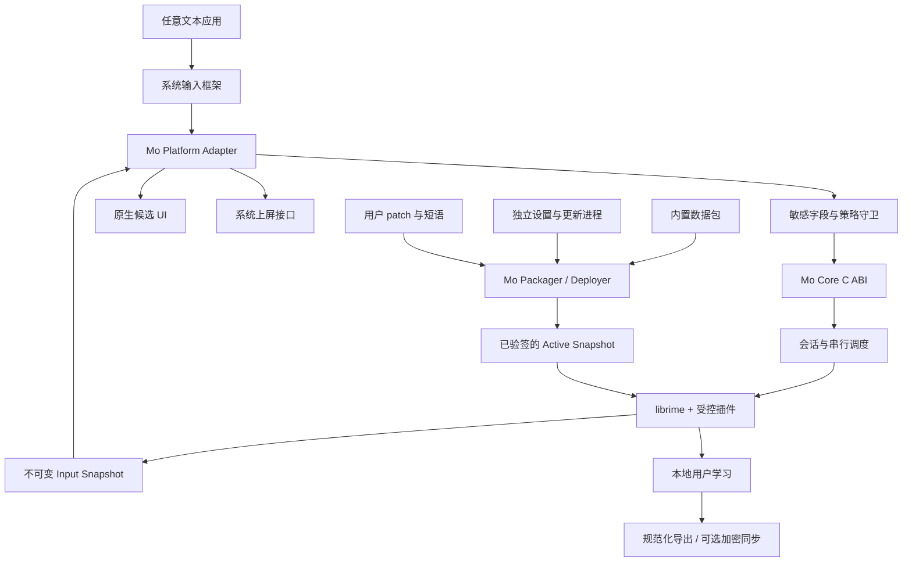
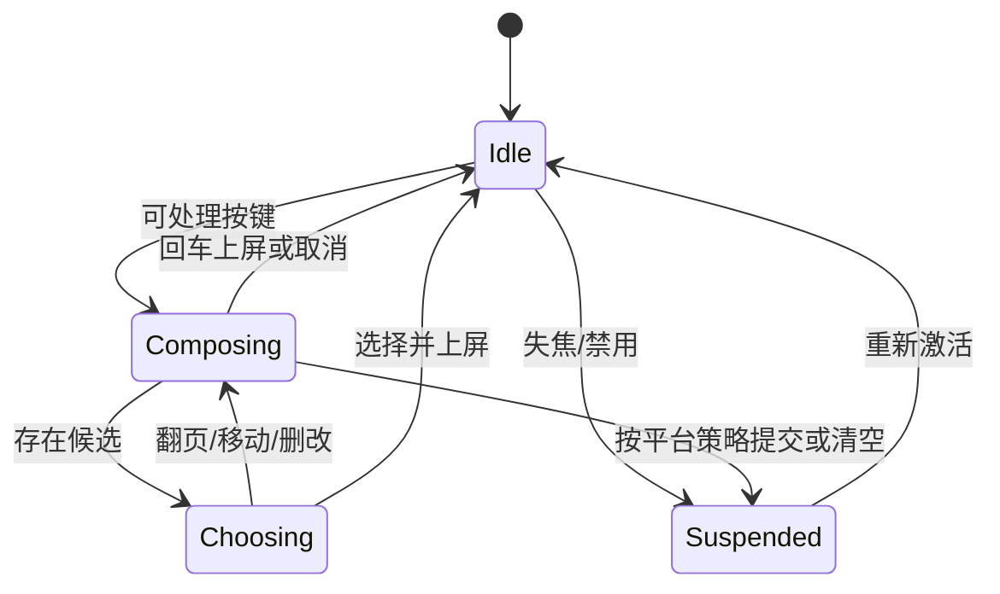

# Mo（墨）输入法：产品与软件架构设计 v0.1

> 本文是已归档的第一轮讨论稿；当前基线请阅读 [v0.2](MO-INPUT-METHOD-DESIGN-v0.2.md)。
>
> 状态：供讨论的基线方案  
> 核验日期：2026-09-11  
> 目标：先确定产品边界、技术路线、许可证策略和交付顺序，再进入工程实现。

## 0. 结论先行

Mo 应被设计成一款“离线完整、Rime 兼容、面向普通用户也好用”的输入法产品，而不是各个平台 Rime 前端的换皮集合。

建议采用以下六项基线决策：

1. 使用 [`librime`](https://github.com/rime/librime) 作为第一代引擎，不重写拼音引擎。
2. 在 librime 之上建立稳定的 `Mo Core C ABI`，各平台不得直接散落调用 Rime C API。
3. 平台输入协议与候选 UI 使用原生实现；共享输入状态模型、数据包格式和测试语料。
4. 输入热路径完全离线；更新、同步、遥测和未来 AI 均放在输入进程之外。
5. 把词库、方案、Lua 和语言模型做成带来源、许可证、签名与版本锁的独立数据包。
6. 默认按“Windows 首发、桌面优先”推进，但核心从第一天保持 macOS、Linux、Android、iOS 可移植。

一句话定位：

> **Mo（墨）：开箱即用的本地中文输入体验，字在本地，习惯归你。**

## 1. 当前假设

这份 v0.1 暂按以下条件设计，后续可由产品决策覆盖：

- 首批目标用户是简体中文全拼用户，同时兼顾自然码和小鹤双拼用户。
- 首发平台为 Windows 10/11，主要面向实体键盘；触屏键盘不是首发重点。
- 产品必须在无账号、无网络、无云服务时完整可用。
- 保留 Rime `.schema.yaml`、`.dict.yaml`、`.custom.yaml` 的兼容能力。
- 第一版追求“快、稳、易配置”，不把云联想、LLM 改写、语音和手写塞进核心范围。
- 当前尚未确定 Mo 是 GPL 开源产品、宽松许可证开源产品，还是闭源商业产品；这是开工前的硬性决策门。

## 2. 产品设计

### 2.1 目标用户

Mo 同时服务三类人，但界面不应让三类人的复杂度相互污染：

- 普通用户：安装后直接输入，不理解 Rime，也不需要编辑 YAML。
- 效率用户：需要双拼、模糊音、自定义短语、应用级中英文状态和词库导入导出。
- Rime 用户：希望已有方案和 `.custom.yaml` 可迁移，并保留高级调试入口。

### 2.2 产品原则

- **本地优先**：核心能力和用户学习不依赖网络。
- **稳定优先**：输入错误、重复上屏和宿主应用卡死属于最高级事故。
- **兼容而不绑死**：Rime 是第一代引擎，不让平台层、配置 UI 和用户数据格式永久绑定其内部结构。
- **简单表面，完整底层**：普通设置可视化；专家模式仍可检查最终配置和部署日志。
- **可解释更新**：每次核心、词库和方案更新都能看到版本、来源、变更，并能一键回滚。
- **隐私可验证**：输入进程不含网络客户端；日志默认不记录按键、候选、上屏文本或密码字段。

### 2.3 MVP 范围

首个可公开测试的 Windows MVP 包含：

- 全拼、自然码双拼、小鹤双拼。
- 简体中文、英文直输、中英混输、常用标点、简繁切换。
- 候选选择、翻页、光标移动、删除候选/降频、用户词频学习。
- 自定义短语、模糊音、基础纠错、部件拆字反查。
- 跟随系统明暗模式的候选窗，以及字号、横竖排、每页候选数等基础设置。
- 图形化设置程序、部署诊断、数据导入导出。
- 有签名和回滚能力的核心/数据包更新。
- 安装、卸载、升级、崩溃恢复，以及常见应用兼容测试。

MVP 暂不包含：

- 账号体系、云同步、跨设备剪贴板。
- 自动上传输入内容的云联想。
- LLM 自动续写、改写或翻译。
- 语音、手写、OCR。
- 无审核的第三方 Lua/原生插件市场。
- 五个平台同时首发。

### 2.4 设置体验

设置程序分为三层：

- 基础：输入方案、中英文切换、候选数量、外观、常用快捷键。
- 进阶：双拼、模糊音、纠错、应用级规则、词库和自定义短语。
- 专家：Rime 兼容目录、最终合并配置、部署日志、数据包来源、手动回滚。

高级配置不直接改写上游文件。所有 UI 操作都生成 Mo 管理的 patch，用户手写的 `.custom.yaml` 始终拥有最高优先级。

## 3. 为什么选择 librime，而不 fork 每个平台前端

[`librime`](https://github.com/rime/librime) 是跨平台 C++ 输入法引擎，当前稳定版已到 `1.17.0`，采用 BSD-3-Clause。其引擎由可配置的 Processor、Segmentor、Translator、Filter 与 Formatter 管线构成；源码中的 [`engine.cc`](https://github.com/rime/librime/blob/master/src/rime/engine.cc) 直接体现了这一处理链。

Rime 的前端把平台事件交给引擎，再读取 commit、context、status 并呈现预编辑和候选：

```text
按键
  -> Processor
  -> Segmentor
  -> Translator
  -> Menu / Filter
  -> Context + Status + Commit
  -> 平台预编辑、候选窗、上屏
```

可参考的成熟边界包括：

- Windows [`Weasel`](https://github.com/rime/weasel)：TSF DLL、IPC、引擎服务、候选 UI、部署器分离。
- macOS [`Squirrel`](https://github.com/rime/squirrel)：InputMethodKit Controller、每客户端 Rime Session、AppKit 候选面板。
- Linux [`ibus-rime`](https://github.com/rime/ibus-rime) 与 [`fcitx5-rime`](https://github.com/fcitx/fcitx5-rime)：输入框架插件与 librime 分工。
- Android [`Trime`](https://github.com/osfans/trime)：`InputMethodService`、Kotlin UI、JNI 和串行 Rime dispatcher。
- iOS [`Hamster`](https://github.com/imfuxiao/Hamster)：主应用负责管理，Keyboard Extension 负责受限运行。

不建议直接 fork 五个前端，原因是：

- 平台前端大多采用 GPL，可能与闭源或其他许可证策略冲突。
- 五份代码会形成五套会话、更新、设置、数据迁移和错误模型。
- 产品功能会被已有前端的历史结构约束，很难形成一致的 Mo API。
- 品牌换皮很快，但后续每项功能都要重复实现。

建议只复用 librime；GPL 前端主要用来学习系统接入、生命周期和兼容性陷阱。若最终决定 Mo 整体采用 GPLv3，则可以重新评估直接 fork 的收益。

## 4. 总体架构



### 4.1 运行时分层

#### A. Platform Adapter

职责仅限：

- 接收平台键盘事件、焦点和文本框能力。
- 将平台键码与修饰键规范化为 `MoKeyEvent`。
- 管理预编辑、候选列表、候选窗位置和最终上屏。
- 处理激活、失活、应用切换、显示器/DPI、辅助功能和安全字段。
- 在平台允许时提供应用级配置键，但不读取或上传输入文本。

#### B. Mo Core ABI

这是 Mo 自己拥有的稳定边界，隐藏 Rime 的结构体、内存管理和版本差异：

- `MoRuntime`：全局资源、插件、数据快照和部署状态。
- `MoSession`：每个输入上下文独立的组合状态。
- `MoInputSnapshot`：一次返回 handled、commit、preedit、候选、分页与状态。
- `MoPackageService`：校验、编译、测试、激活和回滚数据包。
- `MoPolicy`：敏感字段、日志、学习、网络和脚本能力策略。

各平台不得绕过这一层直接获取 `RimeApi`。

#### C. Engine Provider

第一版只有 `RimeEngineProvider`：

- 封装 `RimeTraits`、模块加载、会话和通知回调。
- 配对释放 `commit/context/status` 等 Rime 所有权对象。
- 将 UTF-8 字节偏移转换为 Mo 的统一文本索引。
- 将部署和用户词典生命周期与活跃会话隔离。

未来如需实验自研模型，只新增 provider 或 reranker，不改变平台协议。

#### D. Native Candidate UI

候选 UI 共享状态模型和设计 token，但渲染保持原生：

- Windows：Direct2D/DirectWrite 候选窗，同时支持 TSF UIless 候选接口。
- macOS：AppKit 非激活面板。
- Linux：优先交给 Fcitx5/IBus 面板，必要时提供 Mo 面板。
- Android/iOS：键盘内部候选栏。

输入进程中不嵌入浏览器/WebView，也不使用跨平台 UI 运行时。

#### E. Settings / Updater

设置与更新是独立应用或受平台约束的主应用，负责：

- 编辑可视化设置并生成 patch。
- 下载、验签、编译和回滚包。
- 导入/导出用户短语和诊断包。
- 展示许可证、版本和数据来源。

它可以联网；按键处理进程不联网。

## 5. 统一会话契约

推荐以版本化 C ABI 暴露最小接口；下面是概念草案，不是最终头文件：

```c
typedef struct {
  uint32_t struct_size;
  uint32_t api_version;
  uint32_t keycode;
  uint32_t modifiers;
  uint64_t sequence;
  bool is_release;
} MoKeyEvent;

typedef struct {
  uint64_t revision;
  bool handled;
  MoString commit;
  MoPreedit preedit;
  MoCandidatePage candidates;
  MoStatus status;
} MoInputSnapshot;

MoResult mo_runtime_create(const MoRuntimeConfig*, MoRuntime**);
MoResult mo_session_create(MoRuntime*, const MoFieldContext*, MoSession**);
MoResult mo_session_process_key(MoSession*, const MoKeyEvent*, MoInputSnapshot*);
MoResult mo_session_select_candidate(MoSession*, uint32_t index, MoInputSnapshot*);
void     mo_snapshot_free(MoRuntime*, MoInputSnapshot*);
void     mo_session_destroy(MoSession*);
void     mo_runtime_destroy(MoRuntime*);
```

关键不变量：

- 同一 session 的事件严格按 `sequence` 串行处理。
- 所有 librime 调用进入同一受控 executor；不允许 UI、更新器和 IPC 线程并发进入 Rime。
- 响应是带 `revision` 的不可变快照；过期 UI 更新必须丢弃。
- commit 采用“最多一次”语义；崩溃恢复不重放未知是否已上屏的事件。
- 失焦时按平台策略提交或清空组合，绝不遗留 marked text 和孤立候选窗。
- 部署只在无组合状态时切换；活跃组合继续使用原 generation。

### 5.1 输入状态机



## 6. 各平台落地模型

### 6.1 Windows：第一实现

Windows 官方要求第三方 IME 使用 TSF、进行数字签名，并兼容 AppContainer。TSF DLL 会进入当前文本应用进程并继承其限制，因此采用以下分进程结构：

```text
宿主应用
  -> MoTSF.dll（薄、无网络、无词库）
  -> 当前用户 ACL 保护的本地 IPC
  -> MoEngineHost.exe（会话、librime、候选状态）
  -> MoCandidateHost.exe 或 EngineHost 内独立 UI 线程

MoSettings.exe / MoUpdater.exe（部署、更新、诊断）
```

Alpha 至少提供 x86 与 x64 TIP，以覆盖 64 位系统上的 32 位宿主；ARM64/ARM64X 作为正式发布门槛单独验证。TSF 注册、安装、卸载和签名纳入自动化验收，禁止通过直接改注册表强制设为默认输入法。TIP 不直接访问用户词库目录；AppContainer 下的数据与 IPC ACL 在 Phase 0 做真实 PoC。

Broker 不可达时，TIP 必须在严格超时内返回：尚未开始组合则按键直通；已有组合则执行可证明安全的取消/清理，绝不能卡住宿主或猜测重放可能已经上屏的事件。

参考：[Microsoft 自定义 IME 要求](https://learn.microsoft.com/en-us/windows/apps/develop/input/input-method-editor-requirements) 与 [Weasel 工程拆分](https://github.com/rime/weasel/blob/master/weasel.sln)。

### 6.2 macOS

使用 InputMethodKit：`IMKServer` 管连接，每个 `IMKInputController` 对应一个客户端和一份 Mo session；通过客户端的 marked text/insert text 接口预编辑和上屏。

`MoInput.app` 可以直接内嵌 runtime，因为它本身已是独立输入法进程；设置和更新仍使用独立伴随应用。所有 Rime UTF-8 偏移在 Core 内转换，Swift 层只接收安全的范围。

参考：[Apple InputMethodKit](https://developer.apple.com/documentation/inputmethodkit) 与 [Squirrel 架构说明](https://github.com/rime/squirrel/blob/master/SKILL.md)。

### 6.3 Linux

优先顺序为 Fcitx5 插件、IBus Engine；不要在第一版直接绑定实验中的 Wayland 输入协议。核心在拿不到 surrounding text 时也必须完整工作。

两个前端共享 Core、包管理和 golden tests，但候选面板尽量使用输入框架提供的原生能力。

### 6.4 Android

使用 `InputMethodService` 与系统 `InputConnection`，Kotlin 层管理生命周期和键盘 UI，JNI 只做一次合并调用，返回完整 snapshot。所有 JNI/Rime 操作经过单一 dispatcher。

更新与部署使用后台任务和原子目录替换，不在 `onKey` 中访问网络或执行词典编译。密码类 `EditorInfo` 禁止学习、上下文读取和诊断记录。

参考：[Android InputMethodService](https://developer.android.com/reference/android/inputmethodservice/InputMethodService)、[Android 输入法安全模型](https://developer.android.com/reference/android/view/inputmethod/InputMethodManager) 与 [Trime 的 JNI 边界](https://github.com/osfans/trime/blob/develop/app/src/main/java/com/osfans/trime/core/Rime.kt)。

### 6.5 iOS：最后进入

使用主应用加 Custom Keyboard Extension：

- 主应用负责设置、下载、验签、编译和 App Group 中的 active 数据。
- Extension 静态链接轻量 Core，只读取已验证快照并维护键盘自身的本地状态。
- 默认不要求“完全访问”；离线输入必须可用。
- 未开启 Full Access 时，主应用可更新共享组中的签名快照，键盘以只读方式消费；需要写回共享容器的自动学习与同步后置。
- 安全字段和电话字段会切回系统键盘，宿主应用也能禁用第三方键盘。
- 首版禁用 Lua 动态能力和大型语法模型，以适应扩展内存及生命周期约束。

参考：[Apple 自定义键盘界面](https://developer.apple.com/documentation/uikit/configuring-a-custom-keyboard-interface) 与 [开放访问说明](https://developer.apple.com/documentation/uikit/configuring-open-access-for-a-custom-keyboard)。

### 6.6 Unicode 与 surrounding text

各系统使用的文本位置单位不同：Rime 和部分 Wayland 接口常见 UTF-8 字节偏移，Windows TSF 使用平台文本位置，Apple/Android API 又常以 UTF-16 单元表达。Core 不得传递无单位的裸 `int offset`。

建议定义强类型：

```text
Utf8ByteOffset
Utf16CodeUnitOffset
UnicodeScalarIndex
GraphemeClusterIndex
```

平台 Adapter 负责受检转换；面向用户的删除按扩展字素簇处理。测试语料必须覆盖代理对、组合附加符、ZWJ Emoji、旗帜、肤色、异体选择符与中日韩扩展区。

`surrounding_text` 永远是有长度上限、可缺失、不可完全信任的提示。核心在完全拿不到它时也必须正常输入。

## 7. 词库与方案包设计

### 7.1 五层数据模型

```text
L0  Mo 内置基础资源：Rime 公共资源、OpenCC、最低可用方案
L1  版本锁定的上游包：例如 rime-ice 的只读快照
L2  Mo 产品 patch：默认行为、功能裁剪、产品命名
L3  平台 patch：仅包含真正的平台行为差异
L4  用户 patch / 自定义短语 / 用户学习
```

优先级从 L0 到 L4 逐层覆盖。更新只替换 L0/L1；不得编辑或覆盖 L4。

### 7.2 Mo Pack 清单

每个包至少声明：

```yaml
format: 1
id: org.mo.rime-ice
version: 2026.03.08+mo.1
kind: schema-pack
upstream:
  repository: https://github.com/iDvel/rime-ice
  commit: 6810e8916d160498620a16fef2135956fecbd485
engine:
  min_librime: 1.17.0
capabilities: [dictionary, schema, opencc, lua]
licenses:
  - id: GPL-3.0-only
files:
  - path: rime_ice.schema.yaml
    sha256: BUILD_OUTPUT_SHA256
signature: RELEASE_SIGNATURE
```

`lua`、原生插件和语言模型不是普通“数据”。包管理器必须明确标记能力；社区包若含可执行内容，默认不加载，只有 Mo 签名或用户在专家模式中显式授权后才可启用。

### 7.3 事务部署

```text
拉取元数据
  -> 验证签名、哈希、兼容版本与许可证
  -> 解包到 staging/<generation>
  -> 合并 patch
  -> 编译 Rime 数据
  -> 创建临时 session 跑 smoke cases
  -> 原子切换 current generation
  -> 保留最近两个成功版本
```

失败时不得污染 active 目录；下次启动可回滚到上一个成功 generation。用户数据与可重建的 build 产物物理分离。

### 7.4 用户学习与未来同步

Rime 的 `.userdb` 是运行时数据库，不应直接作为跨设备协议同步。Mo 需要定义可迁移的规范化事件或快照，例如：

```text
{ phrase, code, weight_delta, schema, device_id, logical_time }
```

本地仍可由 Rime userdb 高效运行；导出/同步时转成 Mo 格式，合并后再安全导入。未来云同步必须端到端加密，并允许用户只同步自定义短语、不上传自动学习词。

## 8. rime-ice 接入策略

[`rime-ice`](https://github.com/iDvel/rime-ice) 是很好的简体中文体验基线：它提供全拼、多种双拼、长期维护的中英文词库、纠错、拆字反查、OpenCC、Emoji 和多种 Lua 工具；主方案清楚展示了 Rime 的处理链与依赖。其主词典通过 [`rime_ice.dict.yaml`](https://github.com/iDvel/rime-ice/blob/main/rime_ice.dict.yaml) 分层导入 `8105`、`base`、`ext`、`tencent` 等词库，安装清单见 [`recipe.yaml`](https://github.com/iDvel/rime-ice/blob/main/recipe.yaml)。

截至本设计核验日，可复现的上游起点建议锁定稳定标签 [`2026.06.30`](https://github.com/iDvel/rime-ice/releases/tag/2026.06.30) 对应提交 `6810e8916d160498620a16fef2135956fecbd485`，而不是 `main` 或会被持续覆盖资产的 `nightly`。仓库内各 YAML 的 `version` 并不同步，产品版本必须以 Git commit 加内容哈希为准。

Mo 不应长期维护一个直接改写上游文件的 fork。推荐：

1. 在 `vendor.lock` 固定上游 commit，不跟踪浮动的 `main`。
2. 上游内容只读；Mo 的改动全部写成独立 patch。
3. 将 `weasel.yaml`、`squirrel.yaml` 等前端样式从引擎方案中剥离，由 Mo UI 管理。
4. 把核心词典、英文、拆字、OpenCC 与 Lua 工具分别标注，以便移动端裁剪。
5. 新版本进入用户渠道前，先跑词典格式检查、候选 golden tests、性能测试、许可证/SBOM 检查。
6. 发布包记录上游 commit、Mo patch 版本与完整哈希，支持重现。
7. 所有生成方案使用 `mo_*` ID，避免与用户已有 `rime_ice`、`melt_eng` 等资源碰撞。
8. 将七份重复的双拼 schema 改为“公共方案模板 + 键位 profile + 生成器”，让英文、拆字和中英混输规则同步生成。
9. 不分发上游作者个人习惯的 `custom_phrase.txt`；Mo 用户数据从空白私有层开始。

建议的功能分组：

- `mo-ice-core`：`8105 + base + ext`、全拼和双拼；默认启用。
- `mo-ice-extended`：拆字、英文扩展与中英混输；桌面默认、移动端可裁剪。
- `mo-ice-large`：Tencent 大词库与 `41448` 大字表；按需下载。
- `mo-ice-opencc`：简繁与 Emoji；按用户开关。
- `mo-ice-tools`：日期、农历、计算器、Unicode、金额等 Lua；桌面可选。
- `mo-ice-grammar`：octagram 模型；单独下载、单独测试。

上游 `others` 同时包含普通词条、容错读音和故意错误的拼音/错别字。Mo 应把纠错知识拆成单一规范化数据源，再生成 Rime 词表和提示索引，避免它作为普通高权重词库污染候选。词条还需要来源、区域、NSFW/内容策略标签和回归用例。

### 8.1 许可证门

这是本方案最重要的非技术风险：

- `librime` 是 BSD-3-Clause。
- rime-ice 当前声明 `GPL-3.0-only`。
- Weasel、Squirrel、ibus-rime、Trime 等主要参考前端也采用 GPL 系许可证；`fcitx5-rime` 为 LGPL-2.1-or-later。
- 插件、词库来源和 OpenCC 数据还可能分别拥有自己的许可证。

上游 [`Credits.md`](https://github.com/iDvel/rime-ice/blob/main/others/docs/Credits.md) 还列出了 Unicode License v3、LGPL-3.0、MIT、CC BY 3.0、Apache-2.0 等来源。根目录的 GPL 声明不能替代这些逐项归属与通知义务。

因此有两条可行路线：

#### 路线 A：Mo 采用兼容的开源策略

可以依法复用和修改 GPL 组件，按相应版本履行源码、通知和再分发义务。仍需逐文件维护 SPDX 与第三方来源台账，并单独审查应用商店分发条款。

#### 路线 B：Mo 保留闭源或非 GPL 许可证

只直接复用 BSD 的 librime；GPL 前端只作行为参考，平台适配自主实现。rime-ice 在获得明确法律结论或上游额外授权前，不作为与产品不可分割的内置资产；可以先支持用户独立安装，或改用来源与许可证清晰的自有/宽松许可词库。

这不是法律意见。开工前应明确商业模式，并对实际打包方式做一次许可证审查。

## 9. 安全与隐私架构

输入法天然能看到高度敏感的信息，因此按“高权限本地基础设施”设计。

### 9.1 威胁与控制

- 输入泄露：核心进程无网络依赖；原始按键、preedit、候选和 commit 不进入遥测。
- 密码/支付字段：禁用学习、上下文读取、剪贴板工具和诊断采样；遵循系统安全输入策略。
- 更新劫持：离线根密钥、签名元数据、SHA-256 文件清单、版本回滚与发布审计。
- Lua/插件供应链：视为代码；能力清单、签名、默认拒绝未知可执行包。
- IPC 注入：仅当前用户可访问、协议版本化、会话随机数、严格长度上限、拒绝乱序消息。
- 配置破坏：staging 构建、临时会话验证、原子切换、保留上一成功版本。
- 日志泄露：日志只记录事件类型、错误码、版本和耗时；文本字段在类型层面不可序列化。
- 崩溃重复上屏：commit 最多一次，不重放确认状态不明的按键。

### 9.2 网络原则

```text
允许联网：Settings / Updater / 用户主动调用的未来在线功能
禁止联网：TSF/IMK/IME 热路径、Mo Core、候选 UI、默认用户学习
```

若未来加入 AI，必须由显式动作触发并显示即将发送的文本范围；不得后台流式上传所有按键或 surrounding text。

### 9.3 数据等级

- D0 公共数据：系统词典、方案、模型；可签名更新。
- D1 用户显式数据：设置、用户主动添加的短语；未来可选择端到端加密同步。
- D2 推断数据：本地学习词频和排序计数；默认不上传，单独授权。
- D3 禁止上传：原始按键、未提交拼音、surrounding text、剪贴板、密码/PIN、目标应用内容与应用身份。

大陆地区若未来提供账号、在线词库或同步，应在上线前专项核查个人信息保护影响评估、跨境数据路径、APP 备案和应用商店规则。纯离线 Preview 也仍需明确隐私说明，但不应为了赶进度提前引入云端合规面。

## 10. 性能与可靠性预算

以下是产品验收预算，不是当前实测值：

- 单次按键到 Core snapshot：参考机 p95 小于 8 ms，p99 小于 16 ms。
- 按键到候选首次绘制：p95 小于 25 ms。
- 已部署数据的桌面冷启动可输入：小于 500 ms；激活时绝不触发词典编译。
- 本地 IPC 往返：p95 小于 3 ms。
- 空闲 CPU：接近 0；后台部署有明确限速且可取消。
- Windows 桌面引擎与 UI 空闲内存：目标小于 100 MB，后续以真实词库校准。
- 引擎崩溃后服务恢复：小于 2 秒；恢复时不重复上屏。
- 数据包升级：任何失败都保持上一版本可输入。
- 公开 Beta 的无崩溃会话率：至少 99.95%。

## 11. 仓库建议

```text
Mo/
  core/
    include/mo_core.h
    runtime/
    providers/rime/
    policy/
  platforms/
    windows-tsf/
    macos-imk/
    linux-fcitx5/
    linux-ibus/
    android-ime/
    ios-keyboard/
  apps/
    settings/
    updater/
  packs/
    mo-default/
    patches/rime-ice/
    vendor.lock.yaml
  tools/
    mo-pack/
    corpus-runner/
  tests/
    golden/
    compatibility/
    performance/
    fuzz/
  third_party/
    manifest.lock
    NOTICE/
  docs/
    adr/
    threat-model/
```

工程技术基线：

- Core 使用 C++17，与 librime 基线一致。
- 平台桥接使用稳定 C ABI；结构体均带 `struct_size` 与 `api_version`。
- Windows 使用 C++/COM/TSF；macOS/iOS 使用 Swift；Android 使用 Kotlin + JNI；Linux 使用 C/C++。
- 核心依赖固定 tag/commit 与校验和，CI 生成 SBOM 和第三方通知。
- 产品版本、Core ABI、librime、平台壳、数据包与用户数据格式分别版本化。

## 12. 测试战略

### 12.1 Headless golden tests

维护平台无关的输入语料：

```yaml
- name: basic-nihao
  schema: mo_pinyin
  keys: [n, i, h, a, o, space]
  expect:
    commit: 你好
- name: cancel-composition
  schema: mo_pinyin
  keys: [z, h, o, n, g, escape]
  expect:
    composing: false
```

每次 Core、librime、rime-ice 或 patch 更新都跑相同语料，并记录首选候选、候选集合、preedit、commit 与状态差异。对于同一版本，还应与原生 Rime 参考 runner 做差分测试。

### 12.2 平台兼容测试

- Windows：Win32、WinUI、浏览器、Electron、Office、终端、系统搜索、UIless 模式、多显示器、DPI、远程桌面。
- macOS：AppKit、SwiftUI、浏览器、Electron、终端、安全输入、应用快速切换。
- Linux：X11/Wayland 下的 Fcitx5 和 IBus，GTK/Qt/Electron。
- Android：不同 API、厂商 ROM、横竖屏、分屏、硬件键盘、IME 进程回收。
- iOS：Extension 重建、低内存、宿主禁用、安全字段、无 Full Access。

### 12.3 工程测试

- 配置和包清单 fuzz。
- C ABI、JNI、Swift/C 的所有权与越界测试。
- 更新中断、磁盘满、损坏包、降级攻击与回滚测试。
- IPC 超时、乱序、宿主退出和 engine crash 注入。
- 禁止网络依赖与禁止文本日志的静态检查。
- 安装/卸载/升级和代码签名验收。

## 13. 分阶段路线

以下以一名熟悉 C++/Windows 的主力工程师为估算基准；团队和签名流程会改变时间。

### Phase 0：决策与风险验证，1–2 周

- 决定许可证/商业模式和首发平台。
- 固定 librime 版本，完成第三方许可证清单。
- 做 headless spike：`nihao` 产生候选、选择并 commit。
- 做 Windows TSF 到本地 broker 的最小往返，测 IPC 和启动时间。
- 验证 rime-ice 在选定打包模式下的部署时间、体积和内存。

退出门：许可证路线明确；核心与 TSF 风险被真实代码验证。

### Phase 1：Core 与包系统，2–3 周

- 稳定 C ABI、session executor、snapshot 和错误模型。
- 事务部署、版本锁、签名验证、回滚。
- rime-ice importer/patch 与 headless golden runner。
- 隐私日志和性能基准。

退出门：命令行 runner 连续运行 corpus，无状态泄漏，可完成包升级与回滚。

### Phase 2：Windows Alpha，4–6 周

- TSF、IPC、候选窗、上屏、UIless、应用级状态。
- 设置应用、安装器、更新器和诊断导出。
- x86/x64、DPI、多显示器、辅助功能；ARM64/ARM64X 在 GA 前完成。

退出门：常见应用矩阵通过，能作为开发者日常主输入法使用。

### Phase 3：Windows Beta，3–4 周

- 签名、升级/卸载、崩溃恢复、性能和隐私审计。
- 小规模发布、反馈与数据迁移策略。

退出门：达到性能预算与 99.95% 无崩溃会话目标。

### Phase 4：其他平台

- macOS：预计 4–6 周。
- Fcitx5 + IBus：预计 3–5 周。
- Android：预计 6–8 周。
- iOS：预计 8–12 周，并单独做内存、Full Access 与商店审核设计。

各平台开始前必须先复用同一批 golden tests，不允许复制一份平台专属输入逻辑。

## 14. 开工前需要你拍板的六件事

建议默认值已经给出，你可以逐项改：

1. **许可证/商业模式**：建议“开源 Core + 明确分包许可证”，但是否采用 GPL 必须先定。
2. **首发平台**：建议 Windows 10/11。
3. **首发输入方案**：建议全拼 + 自然码 + 小鹤，简体优先。
4. **rime-ice 关系**：建议固定上游快照 + Mo patch，不维护长期硬 fork。
5. **差异化主轴**：建议“开箱即用、离线隐私、视觉设置、可靠更新”，不以 AI 为第一卖点。
6. **同步策略**：建议 MVP 不做账号和云同步，只做可审计的导入/导出。

这六项确认后，下一步应产出 ADR、仓库骨架、`mo_core.h` v0 草案、包清单 schema、首批 golden corpus，以及 Windows 技术验证代码。

## 15. 权威参考

- [librime 仓库与依赖](https://github.com/rime/librime)
- [librime 1.17.0 Releases](https://github.com/rime/librime/releases)
- [Rime 设计说明](https://github.com/rime/home/wiki/RimeWithTheDesign)
- [Rime 方案说明](https://github.com/rime/home/wiki/RimeWithSchemata)
- [Rime 用户数据目录](https://github.com/rime/home/wiki/UserData)
- [Rime 配置与 patch](https://github.com/rime/home/wiki/CustomizationGuide)
- [rime-ice README](https://github.com/iDvel/rime-ice)
- [rime-ice 主方案](https://github.com/iDvel/rime-ice/blob/main/rime_ice.schema.yaml)
- [rime-ice GPL-3.0-only](https://github.com/iDvel/rime-ice/blob/main/LICENSE)
- [Weasel Windows 前端](https://github.com/rime/weasel)
- [Squirrel macOS 前端](https://github.com/rime/squirrel)
- [ibus-rime](https://github.com/rime/ibus-rime)
- [fcitx5-rime](https://github.com/fcitx/fcitx5-rime)
- [Trime Android 前端](https://github.com/osfans/trime)
- [Microsoft 自定义 IME 要求](https://learn.microsoft.com/en-us/windows/apps/develop/input/input-method-editor-requirements)
- [Apple InputMethodKit](https://developer.apple.com/documentation/inputmethodkit)
- [Apple Custom Keyboard 限制](https://developer.apple.com/documentation/uikit/configuring-a-custom-keyboard-interface)
- [Android InputMethodService](https://developer.android.com/reference/android/inputmethodservice/InputMethodService)
